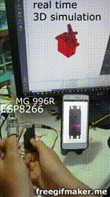
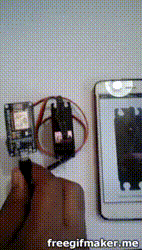

# Welcome to the My-Digital-Servo-Motor wiki!

Control Digital Servo Motor in real time, using application cross platform ( windows, android  ) from network using UDP broadcast.

# Results

## 2019

## 2018

# hardware Setup
in this project i'm using MG996R servo motor

## Wire

| MG996R | ESP8266 |
|--------|---------|
| GND    | GND     |
| 5V     | 5V      |
| PWM    | D7      |

See also: https://easyeda.com/benabadji.mohammed.salim/My-Digital-Servo-Motor

# Software Setup
you need Qt you can download it from official site
and then download source code and build it for any platform you are using 

[App Source Code](https://github.com/salim97/My-Digital-Servo-Motor/tree/master/QT_Application/Src)

# Wiki

url: https://github.com/salim97/My-Digital-Servo-Motor/wiki

# Copyright © 2018-2019

[Benabadji Mohammed Salim](https://github.com/salim97)
